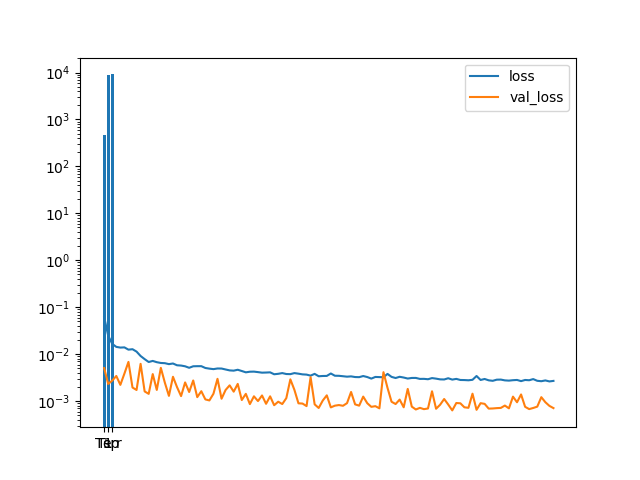
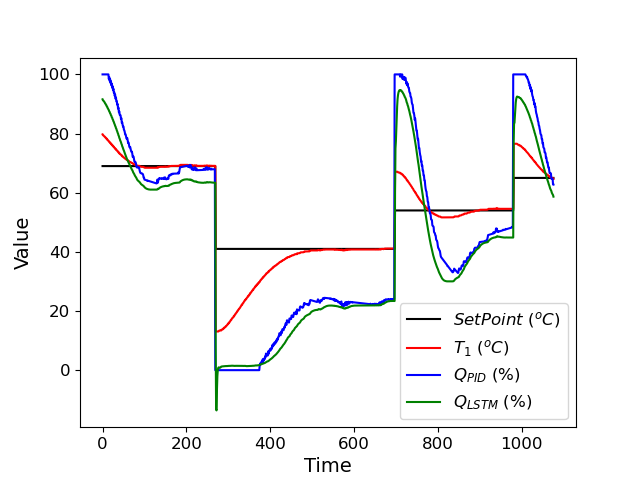

# Room Temperature Control emulating PID control using LSTM.

## CS 539 Machine Learning Project

- Tuning parameters of Kp Ki Kd is exhaustive and non trivial so we train a LSTM model so that we can emulate PID and completely and replace it 

- Please find requirements.txt for dependencies. 

- Following is loss trend of training LSTM

- Here is the predictions of LSTM controller values compared to that of PID heater values

The graph looks like this:

- To train the LSTM network use python3 train_pid.py
- Then a model will be generated it can be used in python3 lstm_pid.py

